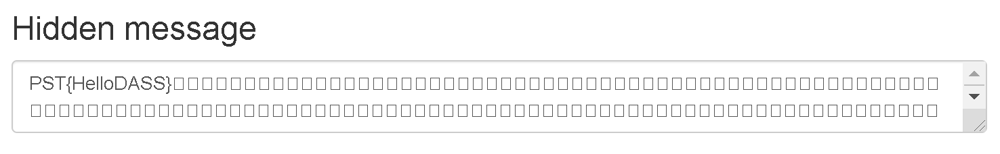

# Luke 1 - Velkommen

```
Velkommen HallvardJC 🙌!

Veldig hyggelig å ha deg ombord og fint å se at du har funnet veien inn til DASS. For at du skal finne deg mer til rette anbefaler jeg deg å sette ditt eget preg på systemet! Dette kan du gjøre ved å velge «Mal» fra startmenyen, mal din egen skrivebordsbakgrunn og velg Fil -> Sett som skrivebordsbakgrunn. Her er det bare kreativiteten som setter begrensninger, men i tilfelle du trenger litt starthjelp, legger jeg ved et eksempelbilde.

Spent på å følge deg videre, lykke til!

Hilsen HR
```


---

## Løsning

Bilde Steganography. Løst med et [online verktøy](https://stylesuxx.github.io/steganography/ "Online Steganography")

